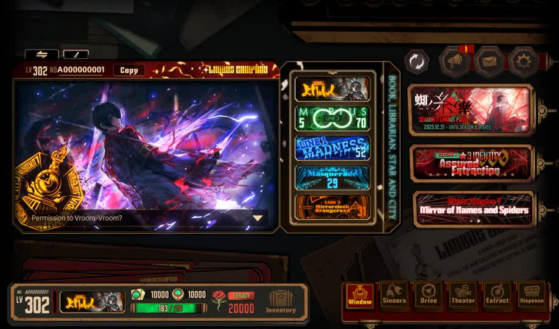
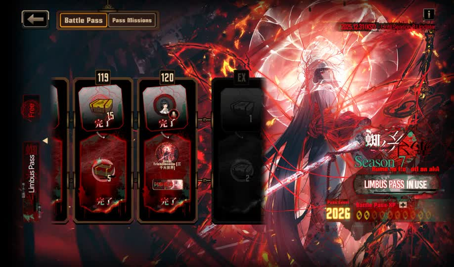
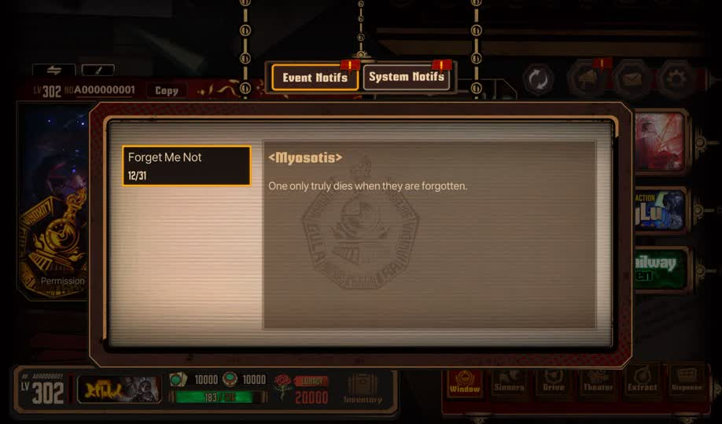
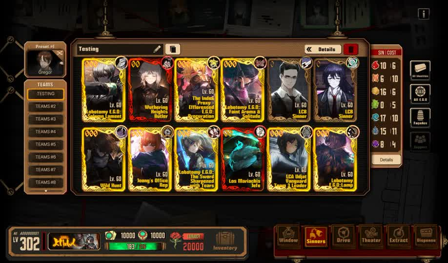
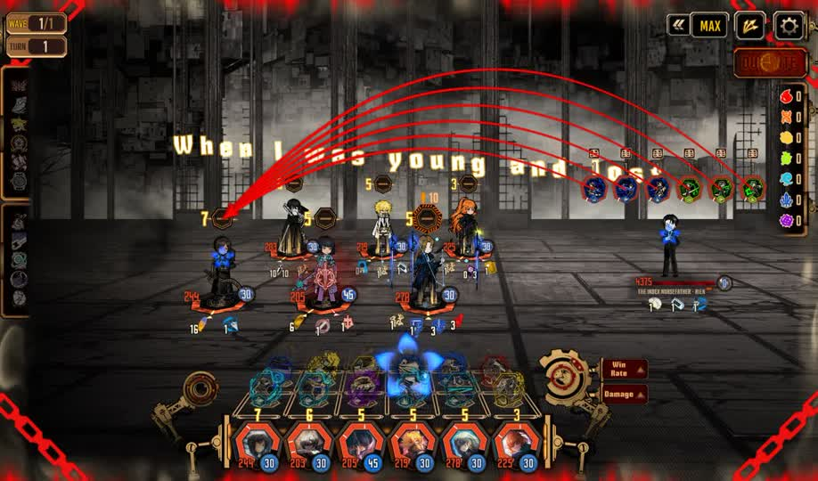
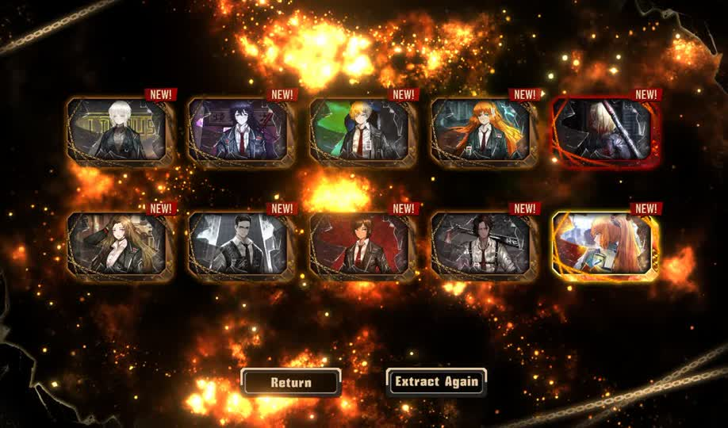

# myosotis-server

Limbus Company private server, originally FurinaLC.

For a better and more complete private server, you can use https://github.com/LEAGUE-OF-NINE/OpenLethe/

## General Showcase

<details>
<summary>Screenshots</summary>

-- --

| | |
|---|---|
|  |  |
|  |  |
|  |  |
| | |

</details>

-- --

<details>
<summary>Features</summary>

-- --

- automatically creates account on login and is maxed out account (battlepass, ids, egos, etc.)

- supports multiple accounts i suppose? no friends doe

- full profile modification! u can modify ur card/banner showcase and whatnot, including support

- teambuilding & announcer stuff

- all stories unlocked so u can just play any node and theater

- story node battles, luxcavation battles

- basic dummy gacha implementation

</details>

-- --

<details>
<summary>Known Limitations</summary>

-- --

- gacha is kinda broken if the banner doesnt have anything in staticdata

- mirror dungeon, story dungeon, railway, refraction are not supported!!

- etc.


</details>

## Setup (Windows)

<details>
<summary>Prerequisites</summary>

-- --

- **.NET 11 SDK**: https://dotnet.microsoft.com/en-us/download/dotnet/thank-you/sdk-11.0.100-preview.7-windows-x64-installer

</details>

-- --

<details>
<summary>Running</summary>

-- --

### Everything below assumes PowerShell

1. clone the repo: `git clone https://github.com/yuvlian/myosotis-server; cd myosotis-server`

2. modify `Config.json` as needed

3. start server: `dotnet run --project Server -c Release`

</details>

-- --

<details>
<summary>Playing</summary>

-- --

1. download https://github.com/yuvlian/myosotis/releases/download/0.1.2/win-x64.7z and extract

3. run `myoink.exe`

4. start limbus company!

</details>

## Project Meta

<details>
<summary>Structure</summary>

-- --

```
myosotis-server/
├── Common/               # shared config, seed values, time/utils
├── Config.json           # server config: host/port, db, static data, blabla.
├── Database/             # ef core + sqlite, 3nf
│   ├── Entities/         # table entities
│   ├── Migrations/       # migrations, duh
│   └── Repositories/     # per-domain data access
├── Resource/             # static data loader
├── Server/               # asp.net core
│   ├── Api/              # /api/* endpoints
│   ├── Iap/              # /iap/* endpoints
│   ├── Login/            # /login/* endpoints
│   ├── Log/              # /log/* endpoints
│   └── Middleware/       # auth + body logging
└── Types/                # game packet types
```

</details>

-- --

<details>
<summary>License</summary>

-- --

MIT

</details>
